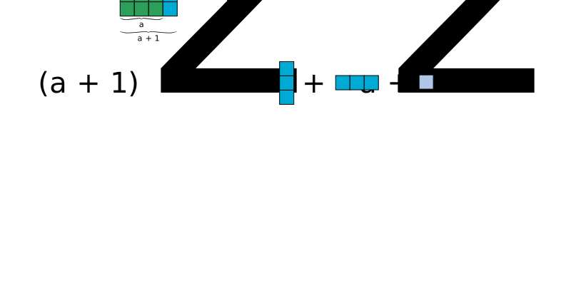

# Square difference geometrically

I'm not sure if I put across a sufficiently clear exposition of the geometrical intuition behind a bound on square differences in the previous class. Let's try again.

## General case.

In general, for any integer `b`, we can compute `b**2` by drawing a tiled square, with each side having length of `b` tiles. Assuming `0 < a < b`, we can compute the difference `b**2 - a**2`using the following image  .

Note that this is a general case, the difference between two squares can be arbitrarily large, , consider for example b = 100 and a = 2.

## The smallest difference

The point here is that the difference cannot be arbitrarily small (assuming that `b` is greater than `a` by at least 1 unit). In fact, if we fix `a`, the smallest difference we can get is when `b = a + 1`. And this difference, as argued in the following image, is exactly `2a + 1` 

So any argument which ends up with the fact that `b**2 - a**2 < 2a + 1` leads to a contradiction, as used in one of the exercises last week.
